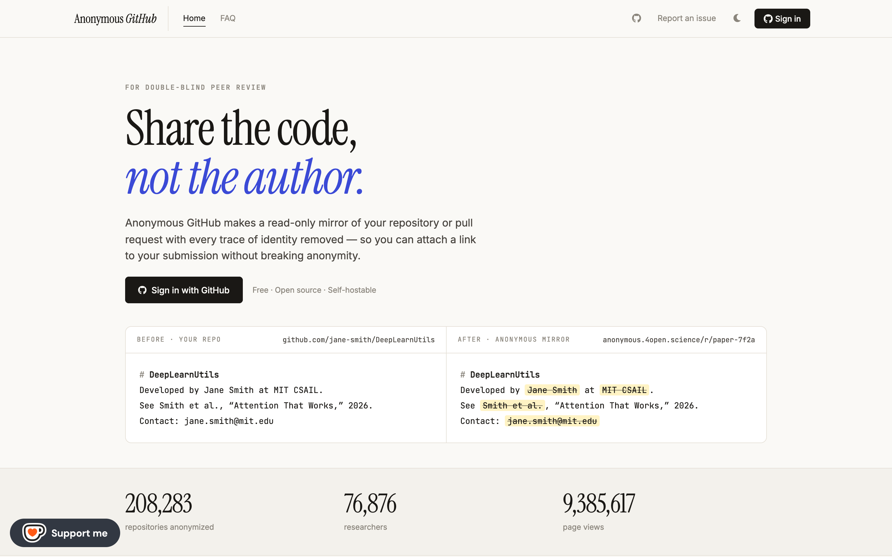

<div align="center">

# Anonymous GitHub

**Share your code and data for double-anonymous peer review — without giving your identity away.**

[](https://www.npmjs.com/package/@tdurieux/anonymous_github)
[](LICENSE)
[](https://anonymous.4open.science/)
[](https://github.com/tdurieux/anonymous_github/stargazers)

[**Public instance**](https://anonymous.4open.science/) · [How it works](#how-it-works) · [Self-hosting](#self-hosting)



</div>

## Why

Double-anonymous review asks you to anonymize the artifact behind your paper — the code and data — exactly like the paper itself. Doing that by hand (owner, organization, repository name, logins, and every mention buried in the files) is tedious and easy to get wrong. Anonymous GitHub does it for you and serves the result behind a shareable link.

A free public instance is available at **[anonymous.4open.science](https://anonymous.4open.science/)**.

## What it anonymizes

- The GitHub **owner, organization, and repository name**
- **File and directory names**
- **File contents** of every extension (Markdown, text, source code, …), replacing a configurable list of terms

## Usage

### Public instance

Just open **[anonymous.4open.science](https://anonymous.4open.science/)**, paste your repository URL, add the terms to hide, and share the generated link.

### CLI

Anonymize a repository locally and produce an anonymized zip:

```bash
npm install -g @tdurieux/anonymous_github
anonymous_github
```

## Self-hosting

<details>
<summary>Run your own instance with Docker</summary>

**1. Clone and install**

```bash
git clone https://github.com/tdurieux/anonymous_github/
cd anonymous_github
npm i
```

**2. Configure GitHub access** — create a `.env` file:

```env
GITHUB_TOKEN=<GITHUB_TOKEN>
CLIENT_ID=<CLIENT_ID>
CLIENT_SECRET=<CLIENT_SECRET>
PORT=5000
DB_USERNAME=
DB_PASSWORD=
AUTH_CALLBACK=http://localhost:5000/github/auth
```

- `GITHUB_TOKEN` — create one at <https://github.com/settings/tokens/new> with the `repo` scope.
- `CLIENT_ID` / `CLIENT_SECRET` — from a new GitHub App at <https://github.com/settings/applications/new>.
- The App's callback must be `https://<host>/github/auth` (matching `AUTH_CALLBACK`).

**3. Start the server**

```bash
docker-compose up -d
```

**4. Open** <http://localhost:5000>. The port can be changed in `docker-compose.yml`; putting Anonymous GitHub behind nginx is recommended for HTTPS.

</details>

## Scope of anonymization

In double-anonymous review, the boundary of anonymization is **the paper plus its online appendix — and only that**. Googling part of the paper or appendix to reveal authorship is considered a deliberate attempt to break anonymity ([explanation](https://www.monperrus.net/martin/open-science-double-blind)).

## How it works

Anonymous GitHub either downloads the full repository and anonymizes each file, or proxies requests to GitHub on the fly. In both cases the original and anonymized versions are cached on the server, so even large repositories stay responsive.

## Related tools

- [gitmask](https://www.gitmask.com/) — contribute anonymously to a GitHub repository.
- [blind-reviews](https://github.com/zombie/blind-reviews/) — browser add-on that hides identifying information when reviewing a pull request.

## See also

- [Open science and double-anonymous peer review](https://www.monperrus.net/martin/open-science-double-blind)
- [ACM policy on double-blind reviewing](https://dl.acm.org/journal/tods/DoubleBlindPolicy)

## License

[GPL-3.0](LICENSE) © [Thomas Durieux](https://durieux.me)
