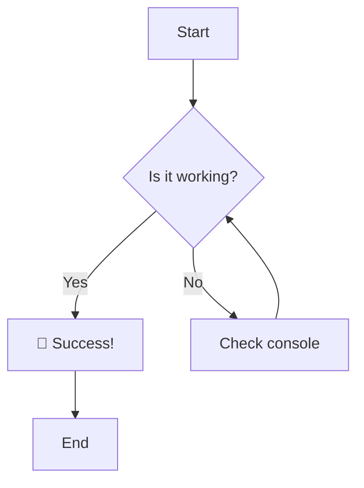
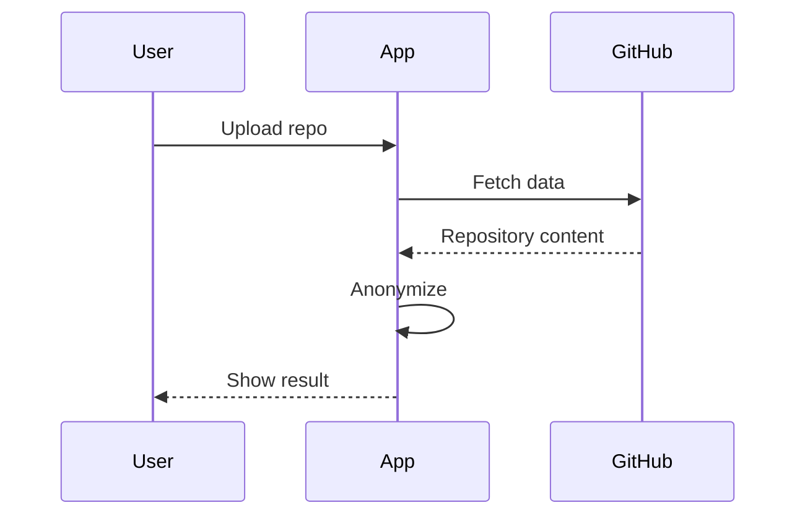
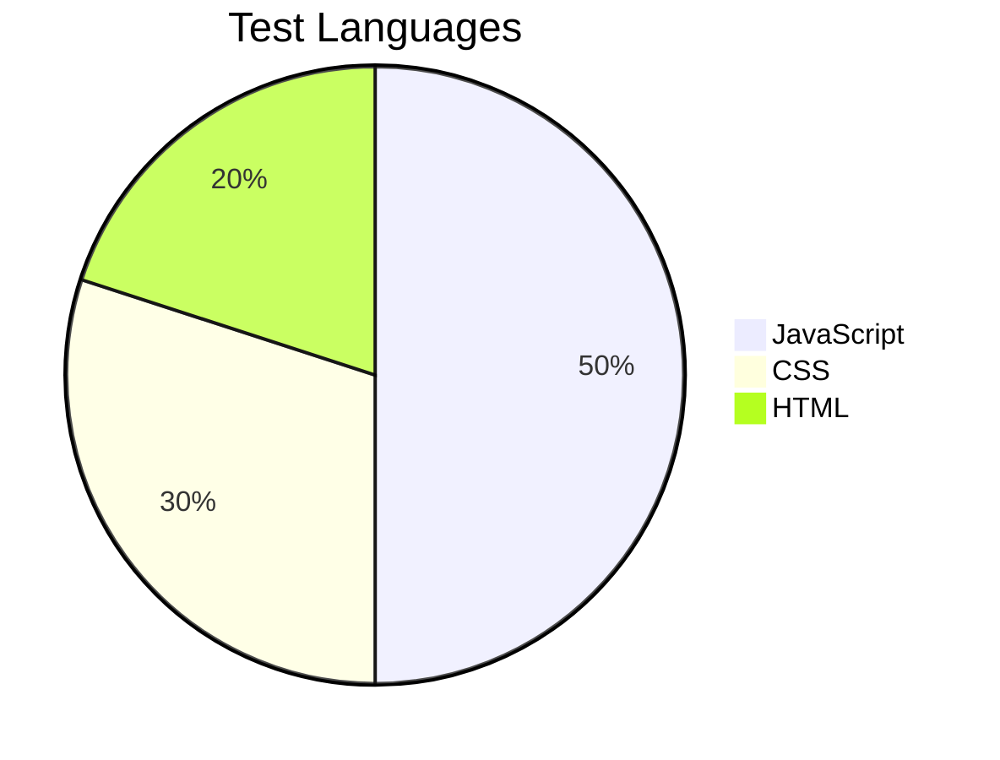
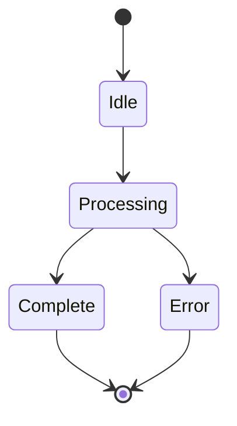

# Mermaid Test File

## Simple Flowchart

## Sequence Diagram

## Simple Pie Chart

## State Diagram

If you can see the diagrams above rendered as interactive graphics (not as code blocks), then Mermaid is working correctly! 